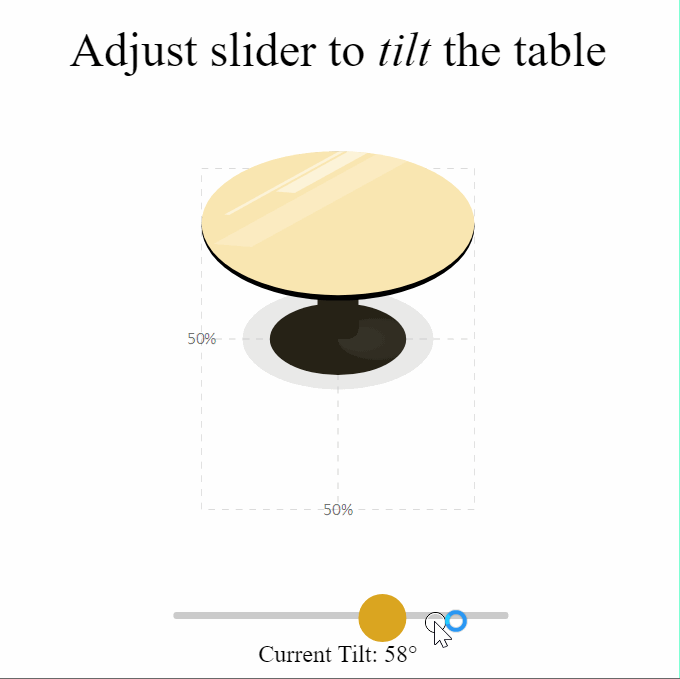
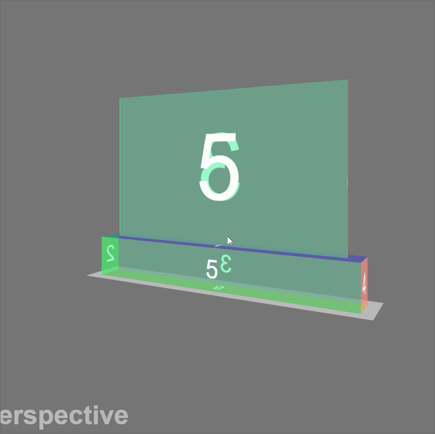
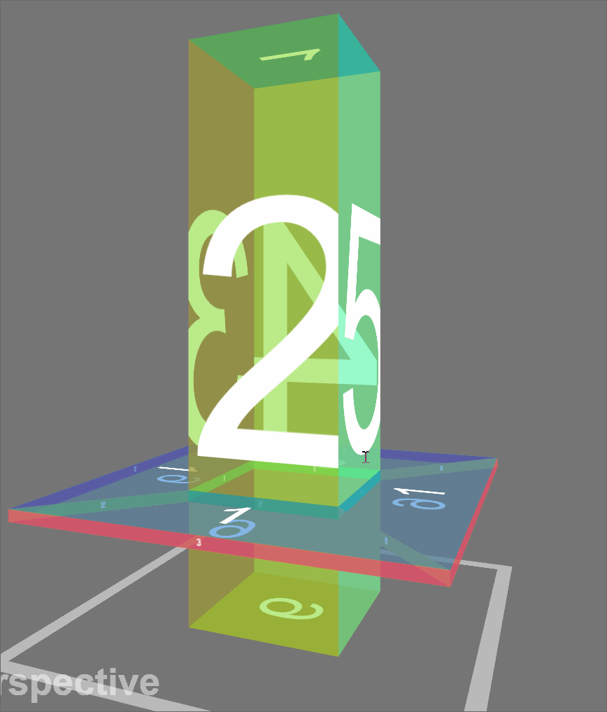
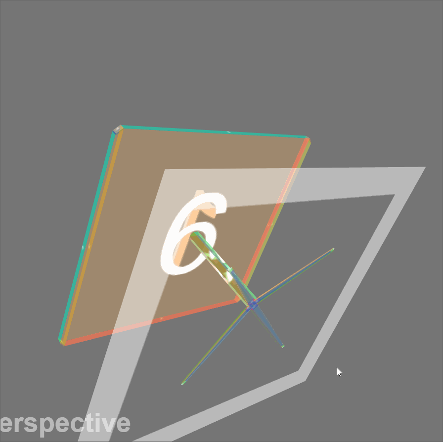
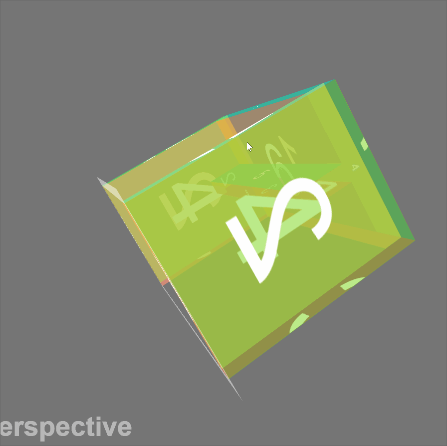
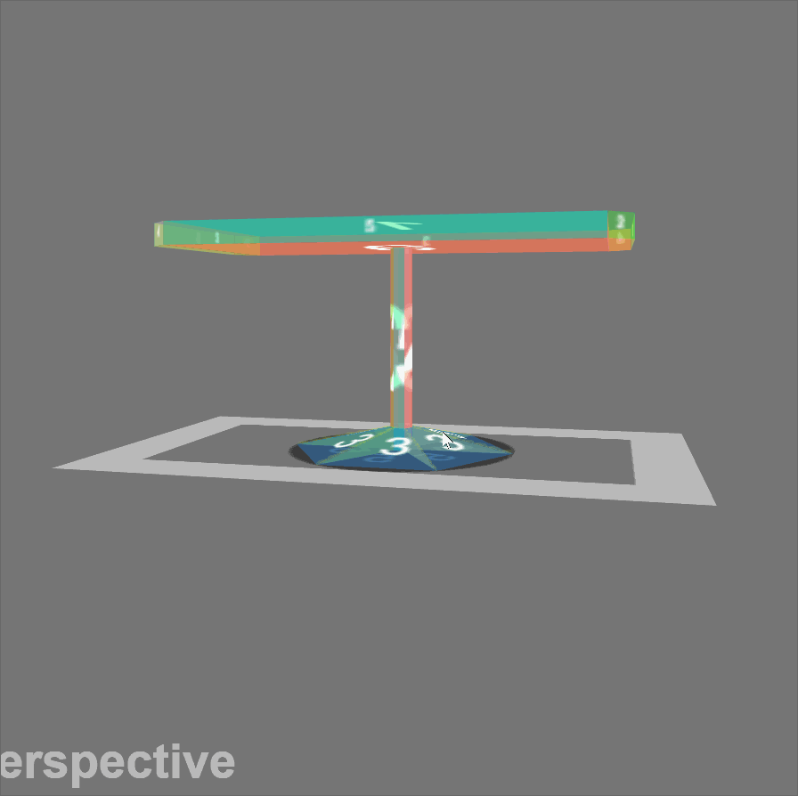
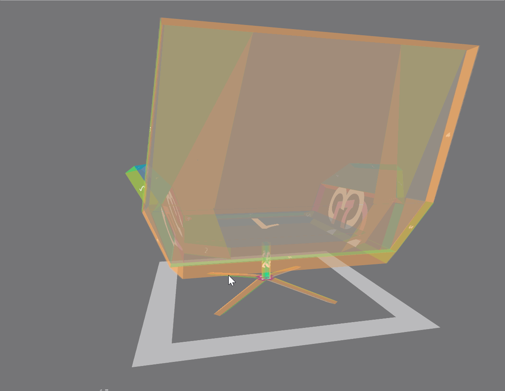

chairs
---

Collection of 3D models of chairs and tables used in [Study Party](https://github.com/sahilshahh/StudyParty) project in EE 461L (Software Lab).

Made with CSS, Sass, and SVG.

Click a preview below to visit the live demo.

---

#### [Circle Table](https://spenceryue.me/chairs/html/circle_table.html)

  

---

#### [Glass Divider](https://spenceryue.me/chairs/html/glass_divider.html)

  

---

#### [Pillar](https://spenceryue.me/chairs/html/pillar.html)

  

---

#### [Fork-Legged Table](https://spenceryue.me/chairs/html/fork_leg.html)

  

---

#### [High Table](https://spenceryue.me/chairs/html/high.html)

  

---

#### [Round Rectangle Table](https://spenceryue.me/chairs/html/round_rectangle.html)

  

---

#### [Comfy Chair](https://spenceryue.me/chairs/html/comfy.html)

  

---

#### [Concept Sketch](https://spenceryue.me/chairs/html/concept.html)

  

---

#### [Study Party App](http://study-party-ut.herokuapp.com)

  

